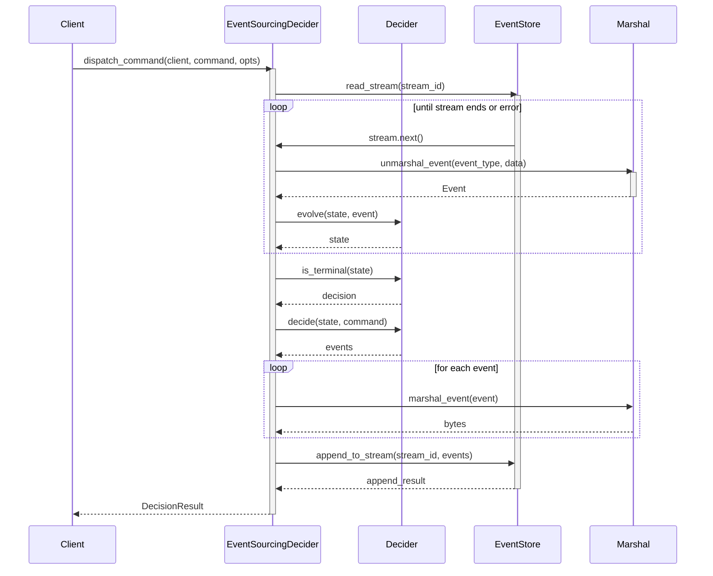

# OnePiece

```mermaid
sequenceDiagram
    participant Client
    participant EventSourcingDecider
    participant Decider
    participant EventStore
    participant Marshal

    Client->>EventSourcingDecider: dispatch_command(client, command, opts)
    activate EventSourcingDecider
    EventSourcingDecider->>EventStore: read_stream(stream_id)
    activate EventStore
    loop until stream ends or error
        EventStore->>EventSourcingDecider: stream.next()
        EventSourcingDecider->>Marshal: unmarshal_event(event_type, data)
        activate Marshal
        Marshal-->>EventSourcingDecider: Event
        deactivate Marshal
        EventSourcingDecider->>Decider: evolve(state, event)
        Decider-->>EventSourcingDecider: state
    end
    EventSourcingDecider->>Decider: is_terminal(state)
    Decider-->>EventSourcingDecider: decision
    EventSourcingDecider->>Decider: decide(state, command)
    Decider-->>EventSourcingDecider: events
    loop for each event
        EventSourcingDecider->>Marshal: marshal_event(event)
        Marshal-->>EventSourcingDecider: bytes
    end
    EventSourcingDecider->>EventStore: append_to_stream(stream_id, events)
    EventStore-->>EventSourcingDecider: append_result
    deactivate EventStore
    EventSourcingDecider-->>Client: DecisionResult
    deactivate EventSourcingDecider

```
